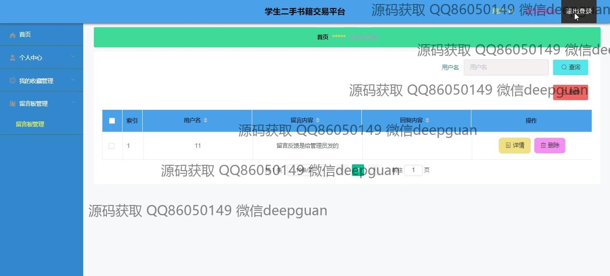
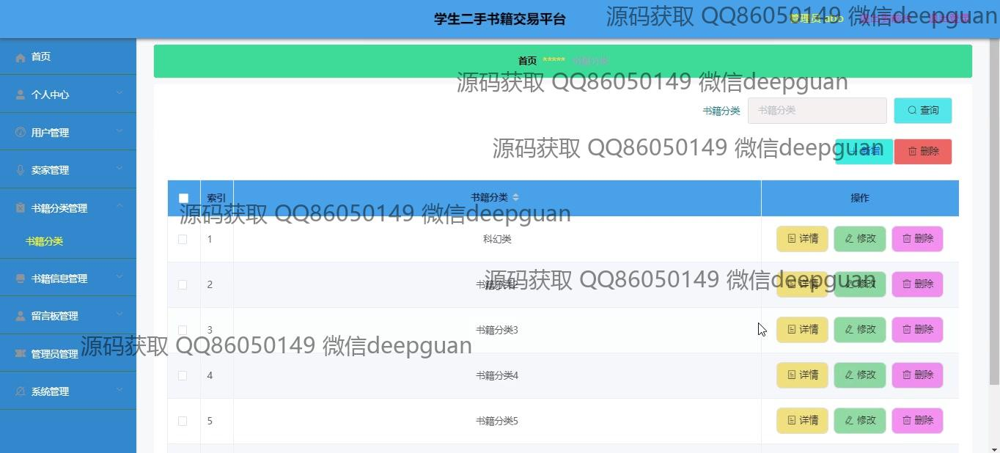

<h1 align="center">基于javaweb的学生二手书籍交易平台的设计与实现+vue</h1>

## 简介
学生二手书籍交易平台：角色分为管理员、用户和卖家；实现功能包括用户注册登录、书籍信息管理、订单管理、个人中心管理、留言反馈、书籍分类管理和后台管理等。    --计算机毕业设计源码；毕设源码；java毕业设计源码

## 联系方式

<h3 align="center">获取完整代码与数据库文件 + 微信：deepguan QQ: 86050149 QQ群: 783742310</h3>

<h3 align="center">可帮忙远程部署 包运行成功！提供远程部署、修改代码、设计文档指导、代码讲解等服务！</h3>

## 功能介绍（完整见运行截图）
管理员： 管理员可以通过平台的后台管理界面对用户、卖家进行管理，包括注册登录的管理、订单管理及留言板管理等功能。书籍分类管理是平台的重要功能之一，管理员可以新增、修改或删除不当内容，确保信息的准确性和标准化。另外，管理员还负责处理用户的留言反馈，能够查看、回复或删除添加的留言，确保平台的良好互动环境。

用户： 用户在平台上可以进行注册和登录，通过个人中心来管理账户和密码信息、上传头像、查看和编辑收货地址。用户能够浏览书籍详情，包括书名、分类、价格和卖家信息，并进行购物车添加、购买等操作。同时，通过个人中心查看订单状态，管理收藏夹，以及进行留言反馈，与平台管理者进行沟通。

卖家： 卖家在书籍管理模块中可以输入书籍的详细信息，包括上传图片、选择分类、定价等，为二手书籍创建分类和展示页。卖家可以在订单管理部分查看订单的状态、详细信息，并与用户进行交易确认等交互。此外，卖家注册后需通过登录界面进行身份确认，以进行书籍信息的管理和订单的追踪。

游客： 游客可以通过首页导航栏浏览平台提供的各种模块和功能选项，包括查看书籍信息和留言反馈区域。游客会被引导至注册界面以完成注册成为用户，体验完整的购物和交易功能。即便未注册，游客可以通过提示快速访问“注册用户”页面进行账号创建。

## 运行截图

本代码来源于网络,仅供学习参考使用!

